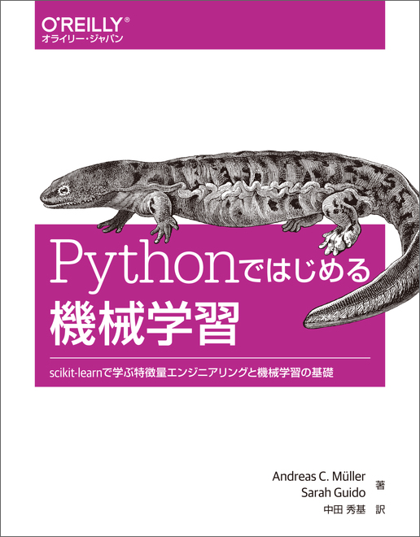

  

# [Pythonではじめる機械学習](https://www.oreilly.co.jp/books/9784873117980/)

- 2018/03/14
    - [Section 1](http://nbviewer.jupyter.org/github/Kthyntr/ics16_python_ml/blob/master/docs/section_1.ipynb)
    - [Section 2](http://nbviewer.jupyter.org/github/Kthyntr/ics16_python_ml/blob/master/docs/section_2.ipynb)
